# Problem 1 (a)
Using Days 
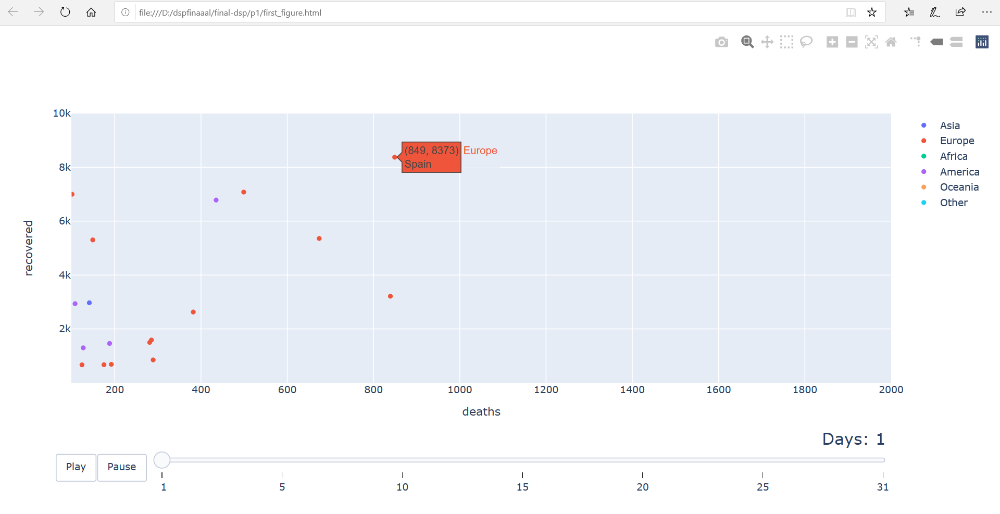
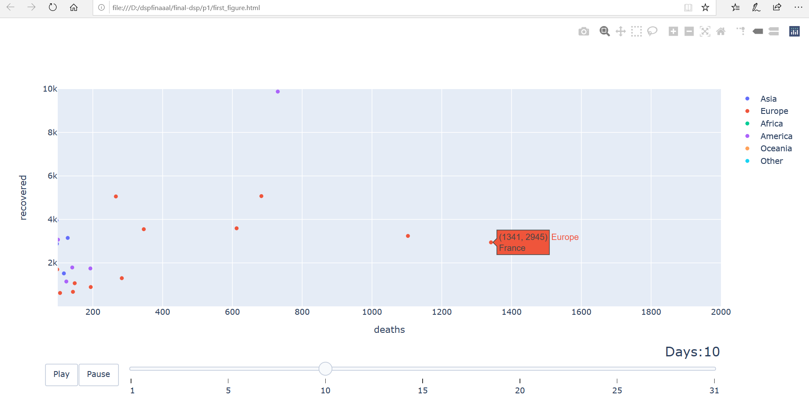
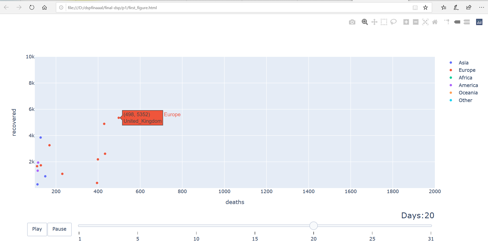
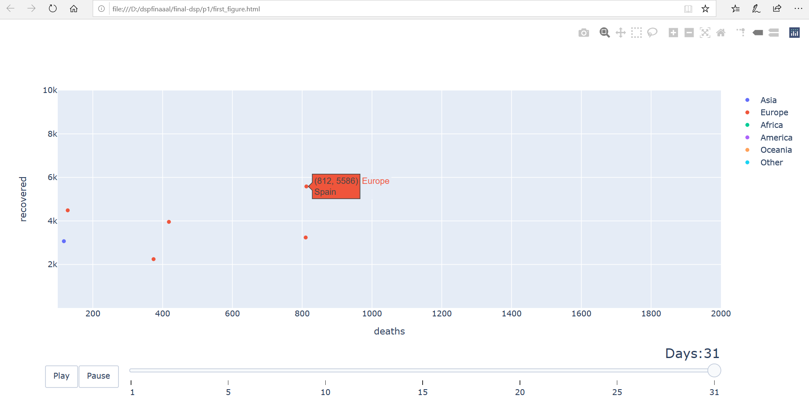
 
 

Using Months
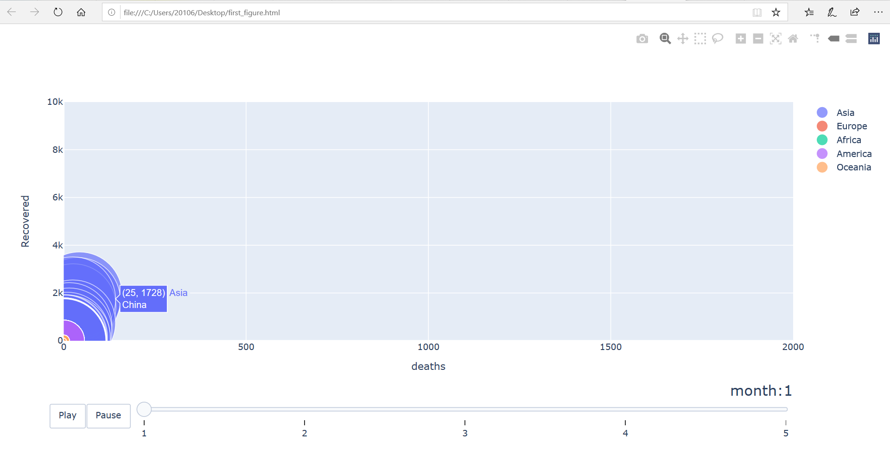
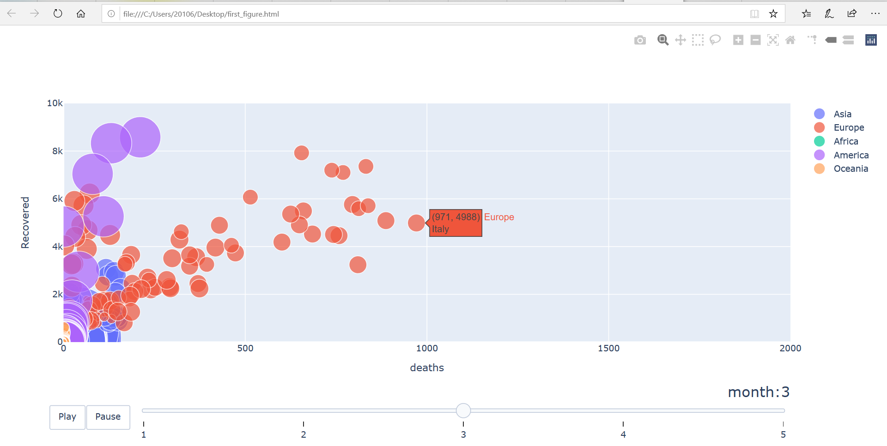
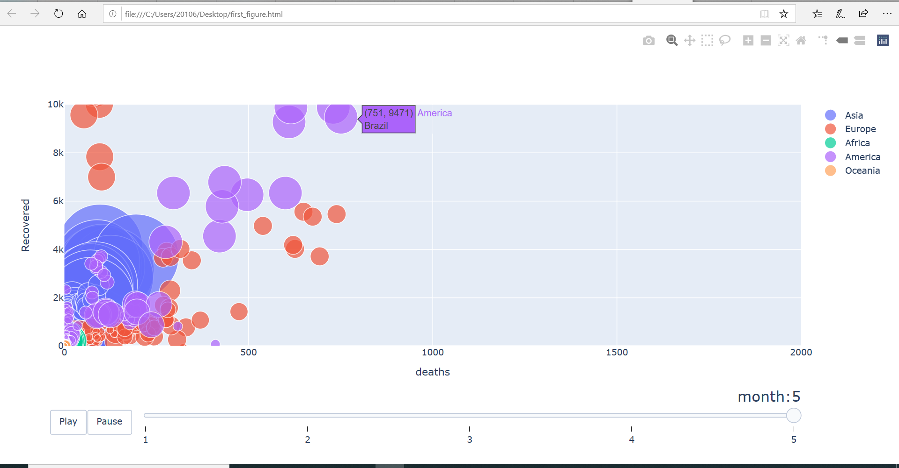

# Problem 1 (b)
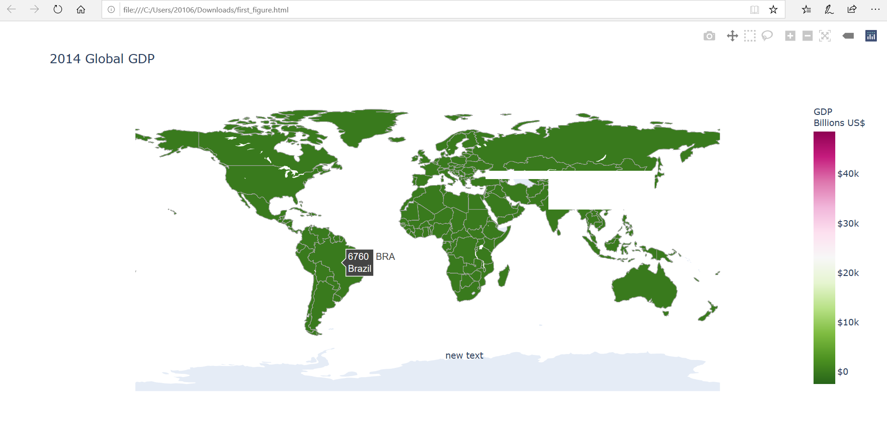

# Problem 1 (c)

The result shows the number of cases for the 15 countries which has the most number cases Within 5 months 
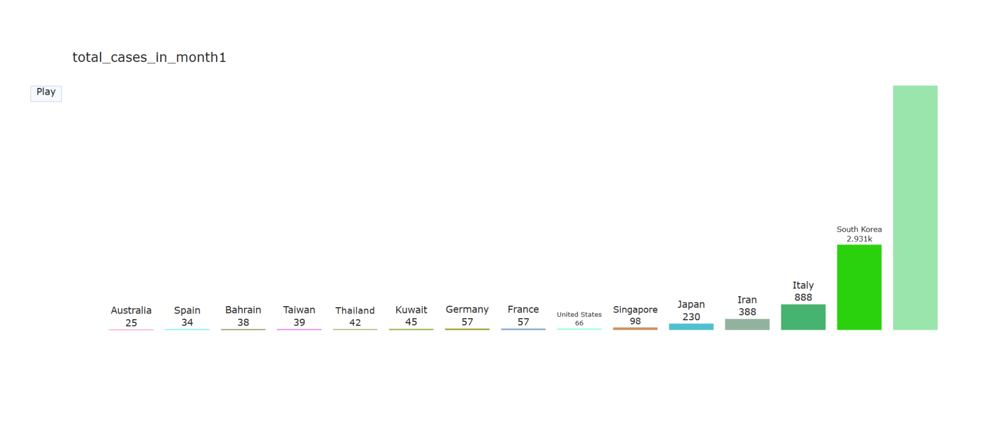
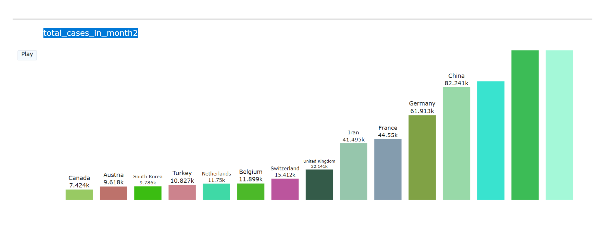
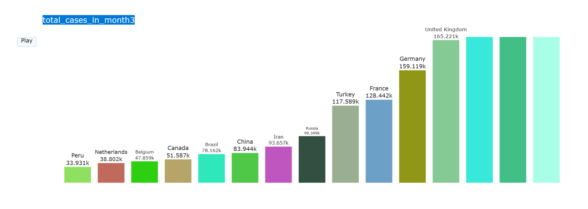
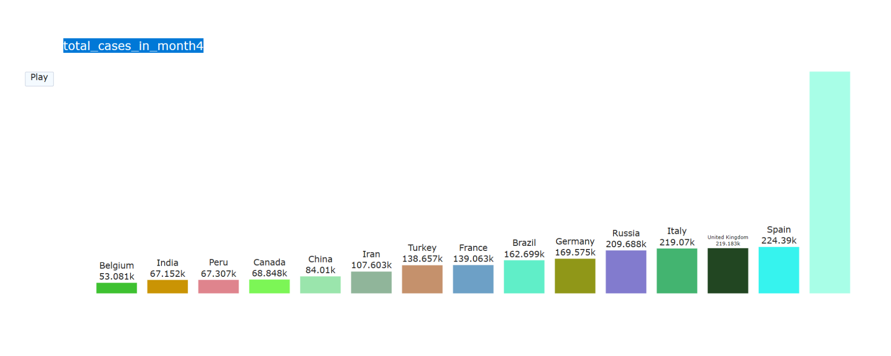
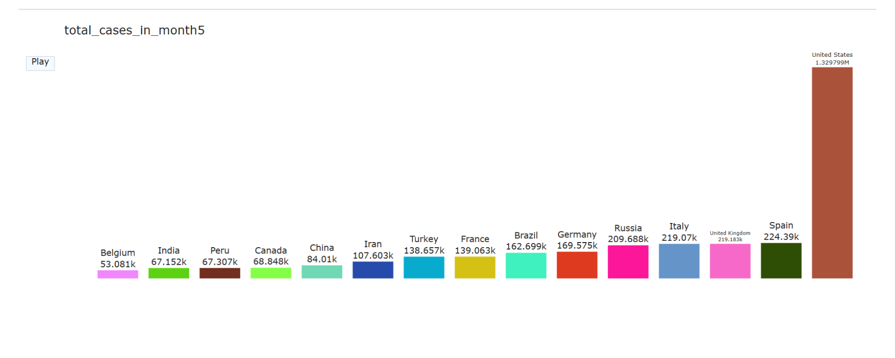

# Problem 1 (d)

 
